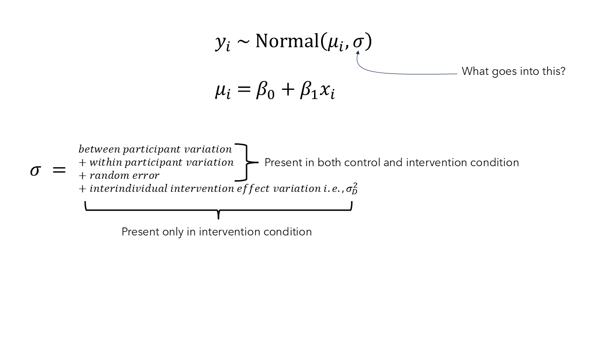

```{r}
#| include: false

targets::tar_config_set(store = here::here('_targets'))
knitr::opts_chunk$set(echo = TRUE, fig.align="center")
options(knitr.kable.NA = '')

library(tidyverse)
library(bayestestR)

```

# Introduction
Variation in responses to resistance training has become a topic of considerable interest within sport and exercise science. Large differences are routinely observed between participants following apparently identical training programmes for outcomes captured such as strength and hypertrophy, and these differences are frequently interpreted as evidence that individuals differ meaningfully in their responsiveness to training. Such interpretations underpin discussions of "responders" and "non-responders", personalised exercise prescription, and the search for biological determinants of intervention responsiveness. However, most people working on this topic confuse the observed variation in *outcomes* with there necessarily being heterogeneity in the *underlying effect of an intervention*. This typically has involved merely considering the distribution of outcomes, usually either absolute (i.e., $y_{i_{post}}-y_{i_{pre}}$) or relative (i.e., $(y_{i_{post}}-y_{i_{pre}})/y_{i_{pre}}$) change scores, observed in the intervention arms of trials which is insufficient for determining whether such variance is due to the effects of the intervention themselves varying between individuals. But, careful consideration of the underlying causal structure of the question of intervention effect heterogeneity allows us to better evaluate whether there is or is not evidence suggesting it is present. 

Traditional pre and post test randomised controlled trial (RCT) designs, where participants undergo one and only one of a number of interventions, are used to test/estimate whether an intervention has some effect and what the average intervention effect is, typically assuming additivity of the intervention effect (i.e., that the intervention effect merely adds to, or subtracts from, the baseline outcome and is constant across participants). But, whilst RCTs of this kind and the inferences drawn from them operate under these assumptions, it may be the case that the intervention effect differs between participants. Partitioning of variance components of observed outcomes such that we can draw inferences regarding the presence (or not) of heterogeneity in the underlying causal effect of intervention is incredibly difficult. Typically, study designs such as those used by Robinson et al. [-@robinsonEffectResistanceTraining2025] (i.e., randomised replicated crossovers) are required where it is possible to determine whether the individual participant level causal effect is replicable. But, in the context of a traditional RCT where the control can be reasonably assumed to be inert (i.e., has no effect itself), such as a non-training control in studies of healthy untrained[^1] participants, we can obtain some insight into whether interindividual heterogeneity in intervention effects may be present.

[^1]: Untrained participants given in a trained population we might expect *a priori* that a detraining effect may occur after cessation of their training. In the case of trained participants, as others have argued [@hammertMethodologicalConsiderationsWhen2024], continuation of existing training may be a better control condition and indeed especially so when participants are already sufficiently trained (i.e., having trained consistently and using known effective interventions for at least one full year; @steeleLongTermTimeCourseStrength2023a; @robertsModelingTrajectorySkeletal2026) such that they are no longer experiencing meaningful intervention effects from participation in current training anyway.

::: {#fig-rct-logic layout-nrow=2 layout-ncol=2}

{height=8cm}

{height=8cm}

{height=8cm}

{height=8cm}

Logic of the randomised controlled trial design shown via directed acyclic graphs for estimating average intervention effects. In (a) we want to estimate the causal effect of an intervention upon some outcome (i.e., the arrow from intervention to outcome), but as in (b) there are often confounders that influence whether the intervention is participated in as well as the outcome. As such, we randomise participants to receive the intervention (c) and now this means that we can obtain an unbiased estimate of the intervention effect because the only thing that causes participation in the intervention is randomisation (d) i.e., there is no "back-door" causal pathway between the outcome and the intervention to introduce confounding. 

:::

The logic of the RCT design (@fig-rct-logic, panel (a)), where possible confounders between intervention and outcome are removed through the process of randomisation, allows us to obtain an unbiased estimate of the clearly defined estimand that is the average intervention effect (@eq-ate-estimand) through comparison of the marginal distributions of outcomes between the conditions e.g., intervention vs control (@eq-ate-estimate): 

$$
\begin{gathered}
\text{Estimand: Average intervention effect} \\
D = Y_{\mathrm{Int}} - Y_{\mathrm{Con}}
\end{gathered}
$$ {#eq-ate-estimand}


$$
\begin{gathered}
\text{Estimate: marginal distributions of outcomes between the conditions} \\
\overline{D}=\overline{Y_{Int}}-\overline{Y_{Con}} 
\end{gathered}
$$ {#eq-ate-estimate}


This estimand, along with its standard deviation (@eq-sd), are well defined under the potential outcomes framework [@caldwellConcernsRegardingStandard2025]. 

$$
\begin{gathered}
\text{Standard deviation of intervention effect} \\
\sigma_{D}^2=\sigma_{Int}^2+\sigma_{Con}^2-2\sigma_{Int}\sigma_{Con}\rho_{Int:Con} 
\end{gathered}
$$ {#eq-sd}

The average causal effect of an intervention in comparison to a control can be easily estimated using a simple general linear model: 

$$
\begin{aligned}
y_i &\sim \text{Normal}(\mu_i, \sigma) \\
\mu_i &= \beta_0 + \beta_1 x_i
\end{aligned}
$$ {#eq-glm}

where $y_i$ is the outcome, $x_i$ is a categorical predictor for the condition i, $\beta_0$ reflects the average outcome in the reference condition (the inert control in this case), and the average intervention effect is estimated by $\beta_1$.

::: {#fig-rct-logic layout-nrow=2 layout-ncol=2}

{height=8cm}

{height=8cm}

{height=8cm}

{height=8cm}

Mapping of estimand and estimate in the randomised controlled trial design for estimating average intervention effects alongside the directed acyclic graph (note, thin arrows from equations map to the elements of the directed acyclic graph (i.e., nodes or causal paths/arrows). In (a) we have the defined estimand of the average intervention effect, our estimate based on the marginal distributions of interventions and controls (i.e., the causal path/arrow from intervention to outcome), and the standard deviation of intervention effects in addition to the general linear model estimator used to yield an estimate of this average intervention effect. The components of the general linear model are mapped to the their corresponding components in the causal structure including the observed outcomes $y_i$, the randomly assigned intervention $x_i$, and the estimated average causal effect of the intervention compared to the control $\beta_1$. In (b), (c), and (d) it shows that some of the variance in observed outcomes i.e., $\sigma$, may be due to intervention effect heterogeneity i.e., $\sigma_{D}^2$ (the dashed arrow in (d) depicting interaction of the individual with the intervention), but that there are numerous other sources of variance and that these also differ between the intervention and control conditions. 

:::

The question of whether an intervention has introduced variation, that is to say that there is some variation in the intervention effect and not merely a fixed effect amongst participants, is essentially a question of comparing variances in this type of study design (@fig-rct-logic, panels (b), (c), and (d)). In the context of an RCT with an inert control the variance $\sigma$ in observed outcomes $y_i$ is due to between participant variation, within participant variation, and other sources of random error in the inert control condition, whereas in the intervention condition only will there potentially be the additional source of variation that is the interindividual variation of the intervention effect itself (i.e., $\sigma_{D}^2$).

For RCTs it is a simple extension of the traditional general linear model to a so-called location-scale model in which variances are modelled directly, for example including the condition as a predictor in the model for this parameter:

$$
\begin{aligned}
y_i &\sim \text{Normal}(\mu_i, \sigma_i) \\
\mu_i &= \beta_0 + \beta_1 x_i \\
\sigma_i &= \alpha_0 + \alpha_1 x_i
\end{aligned}
$$ {#eq-location-scale}

where now $\alpha_0$ reflects the variance in the control condition and $\alpha_1$ estimates the effect of the intervention on the variance. 

There are also various effect size statistics that can be calculated for the comparison of variances such as the standard deviation of individual responses ($SD_{IR}$) [@atkinsonTrueFalseInterindividual2015; hopkinsIndividualResponsesMade2015], the log ratio of standard deviations ($\text{ln}VR$) and the log coefficient of variation ratio ($\text{ln}CVR$) [@nakagawaMetaanalysisVariationEcological2015; @seniorRevisitingExpandingMetaanalysis2020], as well as various other statistical tests for the comparison of variances [@millsDetectingHeterogeneityIntervention2021]. These effect size statistics are particularly useful in the context of meta-analytic approaches for examining the presence (or not) of interindividual intervention effect heterogeneity. However, these effects sizes do come with inherent assumptions that need to be considered when drawing inferences about effect heterogeneity in randomised trials. These include strong assumptions about the correlation between potential outcomes (i.e., the value of the unobservable $\rho_{Int:Con}$) as well as assumptions about the relationship between means and variances (i.e., the $SD_{IR}$ and $\text{ln}VR$ assume the relationship to be zero, whilst the $\text{ln}CVR$ assumes it to be proportional). 

The fact that $\rho_{Int:Con}$ is not directly observable has been termed the fundamental problem of causal inference and is why in RCTs we focus upon the average intervention effect as the estimand of interest (because we can only observe outcomes under a single condition per individual participant and not their potential outcome in the unobserved condition). Caldwell et al. [-@caldwellConcernsRegardingStandard2025] show that the assumed value of the unobservable $\rho_{Int:Con}$ in fact depends on the ratio between the observed standard deviations in the intervention and control conditions (see section 1 in [https://jamessteeleii.github.io/ma_variation_irv_rt/manuscript/supplementary](https://jamessteeleii.github.io/ma_variation_irv_rt/manuscript/supplementary)).

The mean-variance relationship also is ubiquitous in most natural systems, and certainly in outcomes typical of resistance training studies [@steeleMetaanalysisVariationSport2023a; @nuzzoMaximalNumberRepetitions2024], largely due to errors being multiplicative i.e., increase as the mean increases. As such, given that in the context of a RCT of a resistance training intervention compared to an inert control we typically expect an increase in the mean of outcomes such as strength or hypertrophy (assuming the intervention is on average effective), any variance comparisons should account for this possible impact in order to differentiate this coupling from the introduction of variance due to the intervention *qua* intervention. For a single trial, either the location-scale model or use of the $\text{ln}CVR$ is thus preferable.

A further issue though is that the typical RCT in resistance training is woefully underpowered to detect what could be considered realistic variance ratios that we may want to detect between controls and interventions. For example, in their simulations Caldwell et al. [-@caldwellConcernsRegardingStandard2025] show that the typical study of n=20-30 participants may have <25% power to detect these differences and thus the introduction of additional variance by the intervention. Thus, meta-analytic approaches are incredibly value for exploring this question, and with meta-analytic approaches we are also able to go one step farther and directly model the ratio of variances between interventions and controls whilst adjusting for the mean outcomes at the study/arm level. 

Considering the causal logic of the RCT, and the assumptions that need to be examined when making variance comparisons for the purpose of inference regarding intervention effect heterogeneity, in this paper I re-examine the question of whether there is meaningful resistance training intervention effect heterogeneity. To do so I take a meta-analytic approach and use the large scale dataset of RCTs examining resistance training interventions compared with inert controls that we have previously presented [@steeleMetaanalysisVariationSport2023a]. 

# Methods
All data, code, and materials for the present work are available at [https://github.com/jamessteeleii/ma_variation_irv_rt](https://github.com/jamessteeleii/ma_variation_irv_rt). All packages used for analysis are cited in the corresponding report generated by the grateful package which can be seen at [https://jamessteeleii.github.io/ma_variation_irv_rt/grateful-report.html](https://jamessteeleii.github.io/ma_variation_irv_rt/grateful-report.html). 

## Dataset
```{r}
#| message: false
#| warning: false
#| echo: false


targets::tar_load(
  c(
    data,
    data_prepared
  )
)

# filter to only untrained participants and between participant RCTs
durations <- data |>
    filter(train_status == "untrained") |>
    filter(study_design == "between") |>
  group_by(study) |>
    slice_head(n=1) |>
  ungroup() |>
  summarise(mean = mean(weeks),
            sd = sd(weeks),
            median = median(weeks),
            min = min(weeks),
            max = max(weeks),
            iqr = IQR(weeks))


  
  
groups <- data_prepared |>
  group_by(study, arm) |>
  arrange(desc(n)) |>
  slice_head(n=1) |>
  ungroup() |>
  group_by(group) |>
  count()

sample_sizes <- data_prepared |>
  group_by(study, arm) |>
  arrange(desc(n)) |>
  slice_head(n=1) |>
  ungroup() |>
  group_by(group) |>
  summarise(
    n = sum(n)
  )

```

In Steele et al. [-@steeleMetaanalysisVariationSport2023a] we utilised the studies previously systematically reviewed by Polito et al. [-@politoModeratorsStrengthGains2021] which were all RCTs of resistance training interventions compared to non-training controls where it could be expected that the control conditions were essentially inert. As data were unavailable from Polito et al. [-@politoModeratorsStrengthGains2021] we re-extracted data from the studies they identified and full details of this dataset can be seen in Steele et al. [-@steeleMetaanalysisVariationSport2023a] in addition to the extracted data being openly available ([https://github.com/jamessteeleii/Meta-Analysis-of-Variation-in-Resistance-Training/raw/refs/heads/main/data/Polito%20et%20al.%20RT%20Extracted%20Data.csv](https://github.com/jamessteeleii/Meta-Analysis-of-Variation-in-Resistance-Training/raw/refs/heads/main/data/Polito%20et%20al.%20RT%20Extracted%20Data.csv)). Here I limit the dataset to only studies of untrained participants (see footnote[^1]) and explore both the pooled strength and pooled hypertrophy outcomes which resulted in `r length(unique(data_prepared$study))` studies, `r length(unique(data_prepared$arm))` arms (`r groups$n[1]` control arms, `r groups$n[2]` intervention arms), and `r sum(sample_sizes$n)` participants (`r sample_sizes$n[1]` control participants, `r sample_sizes$n[2]` intervention participants) and a median study duration (i.e., intervention length) of `r durations$median` weeks (interquartile range = `r durations$iqr`, min = `r durations$min`, max = `r durations$max`).

## Analysis
An arm-based approach was taken using a multilevel meta-analytic model of the log transformed standard deviations for each outcome at post-intervention[^2] regressed upon the log transformed means for each outcome at post-intervention and the arm from which these variances came (i.e., intervention or control) allowing for comparison of variances between arms whilst adjusting for the population mean-variance relationship which was evidently present in the current data (see section 2 in [https://jamessteeleii.github.io/ma_variation_irv_rt/manuscript/supplementary](https://jamessteeleii.github.io/ma_variation_irv_rt/manuscript/supplementary)). The model was thus: 

[^2]: Note, previously in Steele et al. [-@steeleMetaanalysisVariationSport2023a] we contrasted the variance in change scores between intervention and controls. However, this required in many cases the calculation or imputation of estimated $\rho_{Pre:Post}$ in order to calculate the change score standard deviations when they were not reported. Further, in some cases (likely due to rounding when reporting) change score means for control arms were close to, or in fact, zero which presents an issue for approaches to adjust for mean-variance relationships as the coefficient of variation is undefined for zero as are log transformations. Finally, change scores for outcomes that are negative must be sign transformed and taken as absolute values under the assumption that mean-variance relationships are typically symmetric about zero so that absolute change scores are used. However, in the context of a randomised controlled trial, due to randomisation the post score contrast between intervention and control is an unbiased estimator for the average intervention effect (i.e., the mean) and also any variance contrast given that at post-intervention the variance $\sigma$ in observed outcomes $y_i$ is due to between participant variation, within participant variation, and other sources of random error in the inert control condition, whereas in the intervention condition only will there potentially be the additional source of variation that is the interindividual variation of the intervention effect itself (i.e., $\sigma_{D}^2$). As such, here I present analysis of the post-intervention scores only.

$$
\begin{aligned}
\text{ln}(\hat{\sigma}_{ijk})=\beta_{0}+\tau_{1i}+\tau_{2j}+\tau_{3k}+\beta_{1}\text{ln}(\hat{\mu}_{ijk})+\beta_{2} x_{Cond}+\epsilon_{ijk}+m_{ijk}
\end{aligned}
$$ {#eq-mean-var-meta}

where $\text{ln}(\hat{\sigma}_{ijk}))$ is the log transformed standard deviation of outcomes for the $k^{th}$ outcome in the $j^{th}$ arm in the $i^{th}$ study, $\text{ln}(\hat{\mu}_{ijk}))$ is the log transformed mean of outcomes with the same subscripts, $\beta_{0}$ is the average log transformed standard deviation in the control arms, $\beta_{1}$ is the slope of the log transformed mean upon the log transformed standard deviation, $\tau_{1i}$, $\tau_{2j}$, and $\tau_{3k}$ are the respective normally distributed variances for study, arm, and effect, $\epsilon_{ijk}$ and $m_{ijk}$ are similarly the residual variance and sampling errors respectively, finally $x_{Cond}$ is a categorical predictor indicating whether and effect is from a control or intervention arm and $\beta_{2}$ reflects the estimate of the average difference in variances between the control and intervention arms. 

As noted variance comparisons in RCTs inherently make assumptions regarding the unobservable correlation between potential outcomes ($\rho_{Int:Con}$). As such, in order to draw justifiable conclusions from the analysis I perform here I empirically check these assumptions. I calculate the assumed $\rho_{Int:Con}$ for all the included variance contrasts in the meta-analytic dataset and examine whether the empirical distribution of assumed values are a justifiable assumption to allow us to treat our variance comparisons as indicative of whether there is, or is not, any interindividual intervention effect heterogeneity (see section 3 in [https://jamessteeleii.github.io/ma_variation_irv_rt/manuscript/supplementary](https://jamessteeleii.github.io/ma_variation_irv_rt/manuscript/supplementary)).

Typically, the marginal estimate $\overline{D}=\overline{Y_{Post}}-\overline{Y_{Pre}}$ is not an unbiased estimate of $D=Y_{Int}-Y_{Con}$ and can  be misleading regarding the presence, or not, of interindividual intervention effect heterogeneity[^3]. However, in the case of resistance training interventions in healthy participants with strength/hypertrophy outcomes it is in fact a relatively unbiased estimate of $D$[^4]. As such, $\rho_{Pre:Post}$ might be considered a reasonable estimate of $\rho_{Int:Con}$.

[^3]: For example, this was incorrectly inferred based on variance in observed relative change scores in the now classic paper from Hubal et al. [-@hubalVariabilityMuscleSize2005] on this topic.

[^4]: To check this assumption I compared across all studies and outcomes the sample based standardised effect size estimate either between intervention and control for a pre-post RCT design (i.e., Using Morris' $PPC_2$ with the pooled pre-intervention standard deviation as denominator) and the corresponding standardised effect estimate from the within intervention arm only from pre-intervention to post-intervention (i.e., using Becker's $d$ and the pre-intervention standard deviation as denominator) with corresponding small sample bias adjustment for both. Both effects were very strongly correlated with no obvious systematic bias between estimates (see section 4 in [https://jamessteeleii.github.io/ma_variation_irv_rt/manuscript/supplementary](https://jamessteeleii.github.io/ma_variation_irv_rt/manuscript/supplementary)). 

However, variance comparison methods also assume that rank ordering of responses are similarly maintained in both intervention and control arms and thus that $\rho_{Pre:Post_{Int}}\approx\rho_{Pre:Post_{Con}}$ because: 

$$
\begin{gathered}
\sigma_{Change}^2=\sigma_{Pre}^2+\sigma_{Post}^2-2\sigma_{Pre}\sigma_{Post}\rho_{Pre:Post} 
\end{gathered}
$$ {#eq-sd}

To check this assumption, with the same dataset I examine the meta-analytic estimate for $\rho_{Pre:Post}$ (using a similar multilevel model structure as noted above) for the Fisher's $r$ to $z$ scale transformed values in both intervention and control arms in addition to their difference limiting this to only those studies where it this is directly reported or it is possible to exactly reconstruct the $\rho_{Pre:Post}$ from pre, post, and change score standard deviations. Thus I checked whether the $\rho_{Pre:Post}$ was invariant to the intervention assignment and following this whether the assumed $\rho_{Int:Con}$ distribution was similar to $\rho_{Pre:Post}$ in the included studies. Essentially this answers whether assuming a common value for $\rho$ is reasonable and whether assignment to intervention or control fundamentally changes the covariance structure.

# Results
```{r}
#| message: false
#| warning: false
#| echo: false


targets::tar_load(
  c(
    strength_model,
    hypertrophy_model,
    models_plot,
    rho_assumptions_data,
    pre_post_rho_checks
  )
)

diff_rho_model <- pre_post_rho_checks[1]

```

For strength outcomes the between condition contrast (control minus intervention) is `r round(strength_model$b[3],2)` [95%CI: `r round(strength_model$ci.lb[3],2)`, `r round(strength_model$ci.ub[3],3)`] and for hypertrophy outcomes is `r round(hypertrophy_model$b[3],2)` [95%CI: `r round(hypertrophy_model$ci.lb[3],2)`, `r round(hypertrophy_model$ci.ub[3],2)`]. The meta-analytic scatter plot of  $\text{ln}(\hat{\sigma}_{ijk}))$ regressed upon $\text{ln}(\hat{\mu}_{ijk}))$ for each model can be seen in @fig-results

```{r}
#| message: false
#| warning: false
#| echo: false
#| label: fig-results
#| fig-width: 10
#| fig-height: 5
#| fig-cap: Meta-analytic scatter plot of the log mean and log standard deviation of post-intervention scores for strength (left panel) outcomes and hypertrophy outcomes (right panel). Note, fitted lines are the regression slopes for control group (CON) and resistance training intervention (RT) groups each with their 95% confidence interval band and individual points are scaled in size to their inverse sampling variance.

models_plot

```

The distribution of assumed values of $\rho_{Int:Con}$ can be seen in the online supplementary materials (see section 3 in [https://jamessteeleii.github.io/ma_variation_irv_rt/manuscript/supplementary](https://jamessteeleii.github.io/ma_variation_irv_rt/manuscript/supplementary)), but the highest probability density value was of the distribution of calculated values was `r round(map_estimate(rho_assumptions_data$sdir_rho_xy)$MAP_Estimate,2)` with a 95% highest density interval of `r round(hdi(rho_assumptions_data$sdir_rho_xy)$CI_low,2)` to `r round(hdi(rho_assumptions_data$sdir_rho_xy)$CI_high,2)`. Meta-analytic estimates of the difference in $\rho_{Pre:Post}$ between intervention and controls were $z=$ `r round(pre_post_rho_checks[[1]]$b[2],2)` [95%CI: `r round(pre_post_rho_checks[[1]]$ci.lb[2],2)`, `r round(pre_post_rho_checks[[1]]$ci.ub[2],2)`] and for hypertrophy outcomes is $z=$ `r round(pre_post_rho_checks[[1]]$b[1],2)` [95%CI: `r round(pre_post_rho_checks[[1]]$ci.lb[1],2)`, `r round(pre_post_rho_checks[[1]]$ci.ub[1],2)`]. For strength outcomes the estimated $\rho_{Pre:Post_{Int}}$ was $r=$ `r round(pre_post_rho_checks[[2]][2,3],2)` [95%CI: `r round(pre_post_rho_checks[[2]][2,4],2)`, `r round(pre_post_rho_checks[[2]][2,5],2)`] and $\rho_{Pre:Post_{Con}}$ was $r=$ `r round(pre_post_rho_checks[[2]][4,3],2)` [95%CI: `r round(pre_post_rho_checks[[2]][4,4],2)`, `r round(pre_post_rho_checks[[2]][4,4],2)`]. For hypertrophy outcomes the estimated $\rho_{Pre:Post_{Int}}$ was $r=$ `r round(pre_post_rho_checks[[2]][1,3],2)` [95%CI: `r round(pre_post_rho_checks[[2]][1,4],2)`, `r round(pre_post_rho_checks[[2]][1,4],2)`] and $\rho_{Pre:Post_{Con}}$ was $r=$ `r round(pre_post_rho_checks[[2]][3,3],2)` [95%CI: `r round(pre_post_rho_checks[[2]][3,4],2)`, `r round(pre_post_rho_checks[[2]][3,4],2)`].

# Discussion
The results of this meta-analysis reveal that differences in variances between controls and interventions are at best very small, if anything tend towards a reduction of variance in interventions compared with controls, and are thus likely not meaningful. The assumptions inherent in this variance comparison appear to be justifiable to support the conclusion that there is not meaningful interindividual additive intervention effect heterogeneity for resistance training upon strength or hypertrophy. 

The small difference in variance in the intervention arms compared to control in means adjusted variance comparisons is of little practical relevance, as Mills et al. [-@millsDetectingHeterogeneityIntervention2021] have noted, given that this would occur under homogeneous intervention effects assuming that the intervention itself changes the mean. Alternatively it may be that there are indirect effects of the intervention that serve to reduce other sources of random variation by unintentionally imposing additional control of behaviours or influencing them spontaneously e.g., diet or other physical activity changes during participation in a resistance training intervention (e.g., @hallidayResistanceTrainingAssociated2017). Another possibility is that it may be due to ceiling effects constraining outcomes particularly given that, for strength and hypertrophy, effects begin to plateau around one year after beginning an intervention as they are approximately logarithmic with duration of exposure [@steeleLongTermTimeCourseStrength2023a; @robertsModelingTrajectorySkeletal2026]. However, we limited the studies included to those with only untrained participants and the vast majority of studies were <12 weeks in duration where effects are still approximately linear with duration of exposure.

One assumption inherent to the analysis and results presented is that of additive intervention effects (i.e., that the underlying causal effect of the intervention merely adds or subtracts to the baseline score; @sennControversiesConcerningRandomization2004; @cortesDoesEvidenceSupport2018). However, it is a fact that the choice of scale can impact the appearance of interindividual intervention effect heterogeneity; assuming baseline variance in outcomes a homogeneous additive effect necessarily implies a heterogeneous effect on the multiplicative scale, and vice versa. If it is assumed that effects are instead multiplicative (i.e., that the underlying causal effect of the intervention is some multiple of the baseline score) then for the individual level RCT where participant level data are available transformations such as the natural logarithm can me made to test/estimate the presence and magnitude of multiplicative effects [@liuMultiplicativeTreatmentEffects2020]. However, given we cannot directly observe the underlying causal effects of a given intervention it is impossible for us to know whether or not the effects are truly additive or multiplicative. Choice of whether to assume one or the other therefore has to be taken as a theoretically motivated auxiliary assumption that requires justification. This is not easy to accomplish as, even though the effects of an intervention such as resistance training appear to follow a logarithmic function over duration of exposure when said exposure is sufficiently long [@steeleLongTermTimeCourseStrength2023a; @robertsModelingTrajectorySkeletal2026], whether or not this functional form arises due to truly multiplicative effects (i.e., effects are always a fixed proportion between individuals of their outcome at baseline prior to exposure such that as one continues to get stronger/bigger with exposure the absolute effects become smaller and smaller) or additive effects (i.e., effects are always a fixed addition between individuals to their outcome at baseline prior to exposure but that the magnitude of these absolute effects are conditional upon prior exposure, not baseline value, and as such absolute effects become smaller and smaller) is typically impossible to distinguish between. Further, in the meta-analytic case as presented here, given summary level data is almost always presented only as arithmetic as opposed to geometric means and standard deviations, there is no immediately available approach to examining the multiplicative effect scale without individual participant level data for all included trials. As such, I follow Senn's [-@sennControversiesConcerningRandomization2004] suggestion here that, given there is little that can be done, additivity is an assumption that we can make and not worry about.

# Conclusion
RCTs allow us to make causal inferences about average intervention effects and, as explained, under certain contexts and assumptions (i.e., additivity, inert control, assumed value of $\rho_{Int:Con}$) we can also make inferences about the variance of intervention effects. A number of methods exist to do this in the context of RCTs – though with effective interventions we need to account for the average intervention effects (i.e., mean-variance relationship) – but single trials are typically underpowered/imprecise and thus meta-analytic methods are useful. We can’t avoid having to make some assumptions – that’s just how scientific inference works – but the assumptions of the variance comparisons presented seem justifiable and, making those assumptions, this large scale meta-analysis provides little evidence for there being meaningful intervention effect heterogeneity for resistance training which is also in line with the aforementioned work utilising randomised replicated crossover design to fully partition variance components from Robinson et al. [-@robinsonEffectResistanceTraining2025]. As such, recommendations, policies, and guidelines for resistance training interventions can be simplified and it can be assumed that the average intervention effects estimated in adequately powered and precise trials are constant and experienced by all undergoing the intervention. For example, muscle strengthening interventions such as resistance training are recommended for everyone in current physical activity guidelines and for populations such as athletes where there is likely value in a simple approach to such recommendations assuming constant intervention effects.

# Acknowledgements

I would like to thank Dr Zac Robinson for his continued discussion of this topic and thoughtful input to my own thinking which has shaped this work.

# Funding Information

No direct funding was received for this work.

# Competing Interests

JS provides research consultancy through his company Steele Research Limited, is contracted currently by MacroFactor and Kieser Australia through Steele Research Limited, and has also received travel expenses and honoraria for speaking from fit20 International, Exercise School Portugal, and Discover Strength.

The content does not necessarily represent the official views of the affiliations or contracting organisations listed. 

# Data and Supplementary Material Accessibility

All data and code utilised for data preparation and analyses are available in the corresponding GitHub repository <https://github.com/jamessteeleii/ma_variation_irv_rt>.

# References